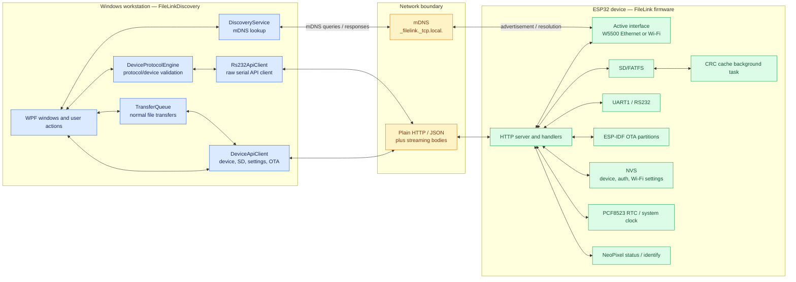

# Architecture and boundaries

Blue is Windows-side processing. Amber is the network boundary. Green is ESP32 firmware and device-owned state. Bidirectional arrows represent request/response, read/write, or status-feedback relationships. The HTTP boundary is plain HTTP, not HTTPS.
