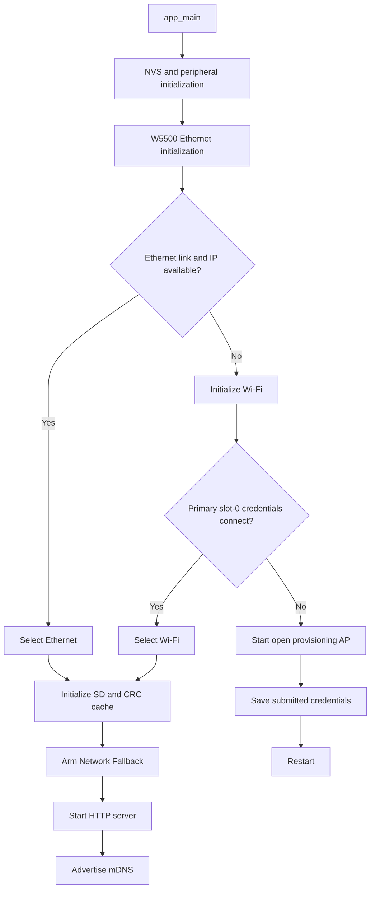

# Startup and networking

This diagram is intentionally directional: it is a lifecycle sequence, not a request/response map. Ethernet is always attempted first. The Network Fallback setting affects runtime behavior after startup, not that initial preference.
