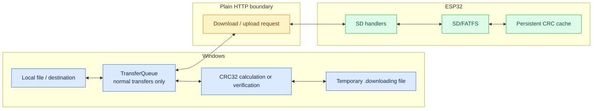
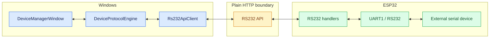

# Transfer and RS232 flows

## SD transfer integrity

## RS232 command path

The direct SD text-editor transfer path bypasses `TransferQueue`; it therefore is not represented as queue-managed work in the first diagram.
