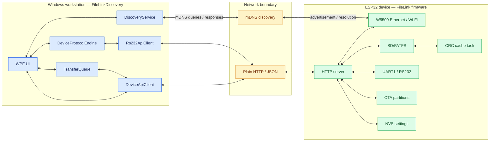

# Architecture diagram

Blue: Windows-side components. Amber: network boundary. Green: device-owned firmware and peripherals. Bidirectional arrows represent request/response or read/write interaction. HTTP is plain HTTP in the supplied implementation; no global endpoint authorization layer is visible.
