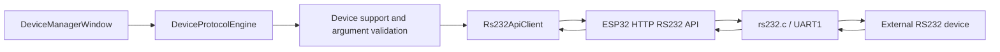

# RS232 communication path

```mermaid
flowchart LR
 UI[DeviceManagerWindow] --> E[DeviceProtocolEngine]
 E --> V[Device support and argument validation]
 V --> R[Rs232ApiClient]
 R --> H[ESP32 HTTP RS232 API]
 H --> U[rs232.c / UART1]
 U --> X[External RS232 device]
 X --> U
 U --> H
 H --> R
```
