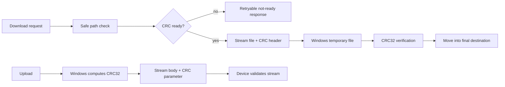

# SD transfer data flow

```mermaid
flowchart LR
 DL[Download request] --> PATH[Safe path check]
 PATH --> CRC{CRC ready?}
 CRC -->|no| NR[Retryable not-ready response]
 CRC -->|yes| STREAM[Stream file + CRC header]
 STREAM --> TMP[Windows temporary file]
 TMP --> VERIFY[CRC32 verification]
 VERIFY --> FINAL[Move into final destination]
 UP[Upload] --> UCRC[Windows computes CRC32]
 UCRC --> USTREAM[Stream body + CRC parameter]
 USTREAM --> CHECK[Device validates stream]
```
