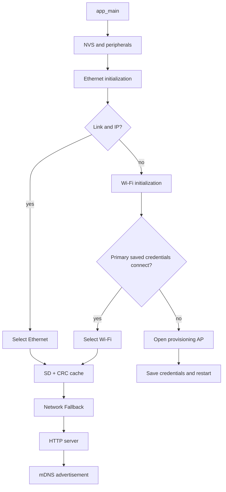

# Startup sequence

```mermaid
flowchart TD
 A[app_main] --> B[NVS and peripherals]
 B --> C[Ethernet initialization]
 C --> D{Link and IP?}
 D -->|yes| E[Select Ethernet]
 D -->|no| F[Wi-Fi initialization]
 F --> G{Primary saved credentials connect?}
 G -->|yes| H[Select Wi-Fi]
 G -->|no| I[Open provisioning AP]
 I --> J[Save credentials and restart]
 E --> K[SD + CRC cache]
 H --> K
 K --> L[Network Fallback]
 L --> M[HTTP server]
 M --> N[mDNS advertisement]
```
