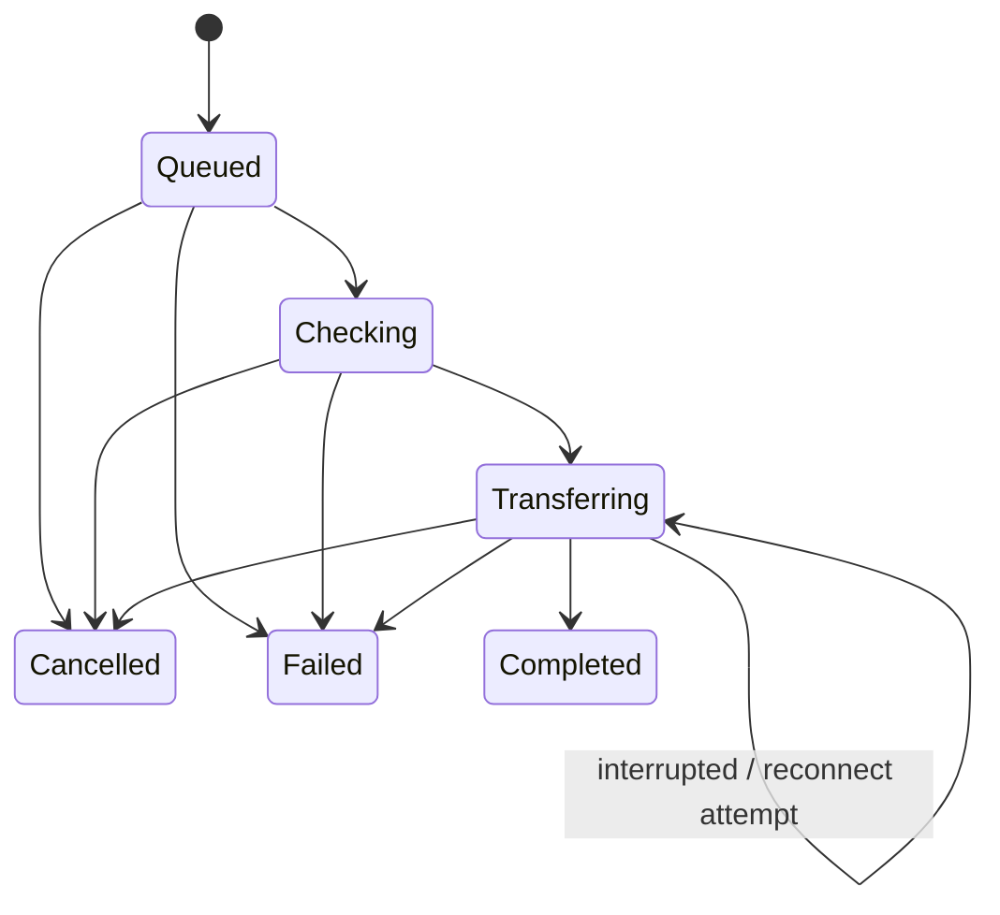

# State machines

## Normal transfer queue

```mermaid
stateDiagram-v2
 [*] --> Queued
 Queued --> Checking
 Queued --> Cancelled
 Queued --> Failed
 Checking --> Transferring
 Checking --> Cancelled
 Checking --> Failed
 Transferring --> Completed
 Transferring --> Cancelled
 Transferring --> Failed
 Transferring --> Transferring: interrupted / reconnect attempt
```

The interruption condition is separate from the displayed transfer state. The direct editor transfer path does not enter this state machine.
